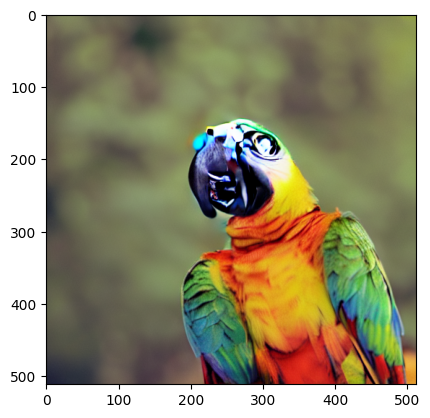
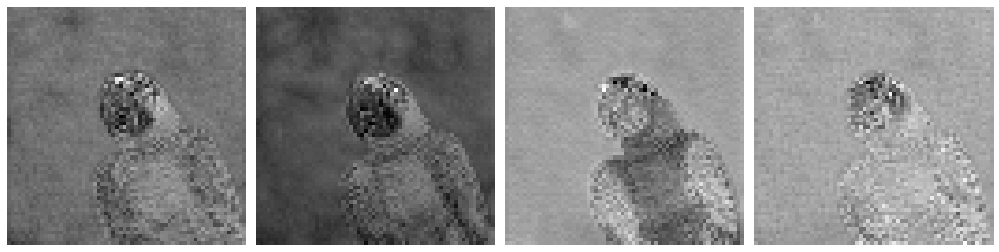
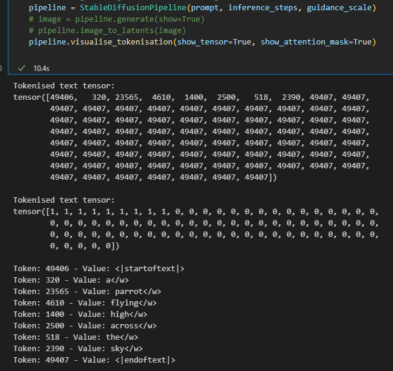
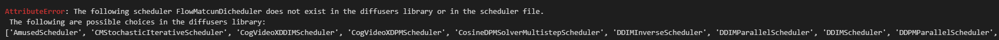
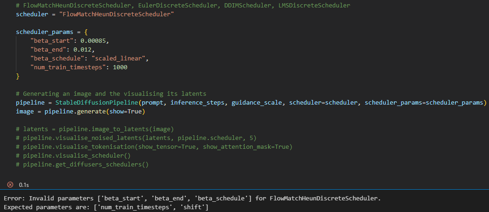
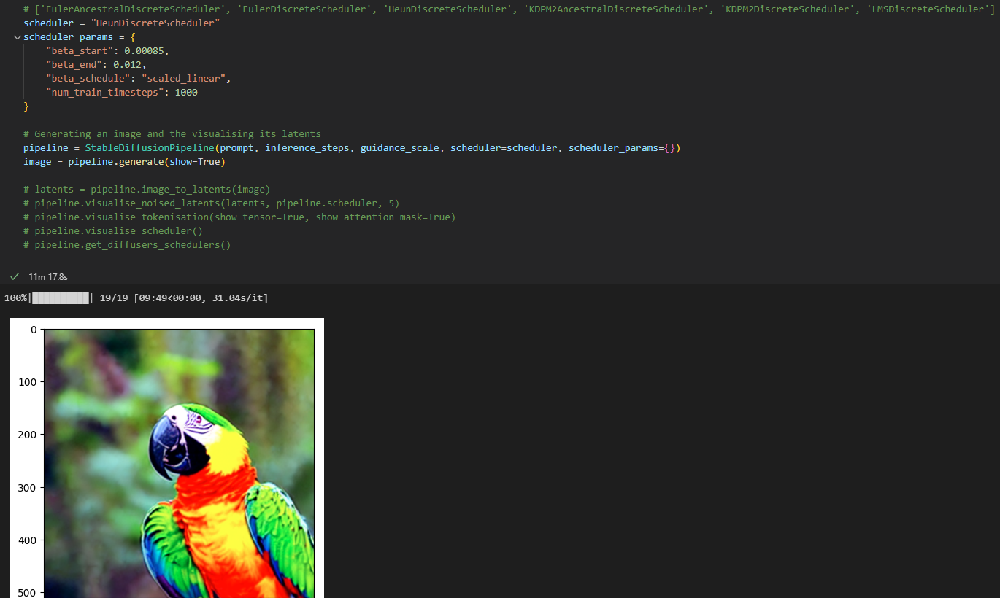

# Stable Diffusion Pipeline

The goal of this project was to get a thorough and deep understanding of the mathematics but also the implementation of the original Stable Diffusion as well as other newer advances in the field like DDIM. 

With this goal in mind I have created several visualisation methods that are all explained below that breakdown every concept at different steps in the pipeline.
You can visualise the initial tokenisation and attention mask where CLIP guides the diffusion process, visualise the latents of any generated image, plot how different schedulers control sigma (and hence the noise) as well as view the noised images affected by any noise schedule.

#### Project Files: 
- main.ipynb - Main script with the entire pipeline and visualisation methods connecting all separate components
- autoencoders.py - Original Autoencoder implementation and VAE implementation, included is a training loop and all of their sections broken down and explained
- unet.py - U-Net implementation, commented based on the paper and other articles linked below
- unet_testing.ipynb - Testing file for understanding different implementations of positional sinusoidal embeddings

## Custom Pipeline Functionality

### Visualising latents & Noised Images

Custom functionality of the pipeline includes visualising the image latents, and any noised image at an intermediate point in the reverse process.

Take this parrot image, this image was for illustration purposes and was not generated on many inference steps (10 in this case), hence the poor quality.

These are the respective latents - our latents have 4 channels but you can build a VAE / AutoEncoder of any dimensions.

Visualising the 5th denoised image (this would be x_5 from x_t to x_0) during inference.

### Visualising latents & Noised Images

The tokenisation process can also be viewed here, the first tensor shows the tokenised tensor that has been padded, the second tensor shows the attention mask, ignoring all values with 0 (padding).

Finally the unique tokens used and their respective token ids / values are shown.

### Choosing Schedulers & Validation

I implemented a method that would return all possible DiscreteSchedulers already implemented in the diffusers library, you can either call this manually or it will be shown to you if you get a scheduler AttributeError as shown below.

The pipeline will also automatically validate your parameters passed to the scheduler

Here is an example of using HeunDiscreteScheduler, a much better parrot image is generated with the same number of inference steps.

## Resources

### Useful Papers I Read

- [U-Net](https://arxiv.org/pdf/1505.04597)

- [Sigmoid Linear Unit - SiLU](https://paperswithcode.com/method/silu)

Here is a comparison of the activation functions which shows the reasoning behind my choice to use a SiLU in my implementation.

- [Stats behind stable diffusion](https://mbernste.github.io/posts/diffusion_part1/)

- [Original Paper](https://arxiv.org/pdf/1503.03585.pdf)

- [DDPM](https://arxiv.org/pdf/2006.11239.pdf)

The following papers I found give improvements to the models and were both released in 2021
- [Paper 1](https://arxiv.org/pdf/2102.09672.pdf)
- [Paper 2](https://arxiv.org/pdf/2105.05233.pdf)

### Other sources

I would highly recommend reading these to get a good understanding.

- [OpenAI CLIP Explanation](https://openai.com/index/clip/)

- [Mathematics Behind DDPM (YouTube)](https://www.youtube.com/watch?v=HoKDTa5jHvg)

## Common Problems & Fixes

If you get any CUDA problems it is likely that your installation is not working, here is a useful tutorial I used
- [Comprehensive StackOverflow Guide](https://stackoverflow.com/questions/60987997/why-torch-cuda-is-available-returns-false-even-after-installing-pytorch-with)

## Future Improvements & To Do List

Karras scheduler paper - https://arxiv.org/abs/2206.00364

Implementing the learned interpolation for beta as implemented by OpenAI

Using attention inside the U-Net